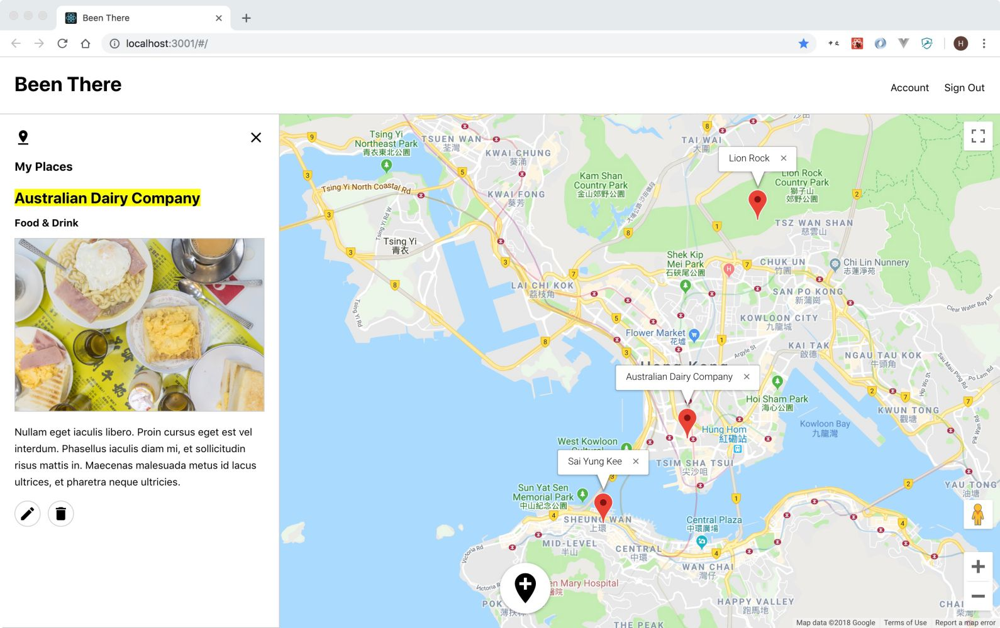

# Project#3: Been There (Front-End)

Skip the reading and go straight to a live version of the site here: [https://been-there-done-that.herokuapp.com./#/login](https://been-there-done-that.herokuapp.com./#/login)

Check out the back-end code here: [https://github.com/HannahGreenwell/BeenThereBackend](https://github.com/HannahGreenwell/BeenThereBackend)

### Description
Been There is a map based app for people who are bursting with travel recommendations (such as that amazing, little dumpling place on the top floor of the Wudaokou Clothing Market in Beijing). Keep all your favourite finds (and their details) in one place and easily share them with your friends and family.

### Features
- Create your very own Been There account and map
- See all your favourite places and their details on your Been There map
- Add new places to your Been There map
- Edit and delete your saved places

### Front-End Built With
- React.js
- JavaScript
- CSS

### Front-End Packages & APIs
- axios
- react-router-dom
- Google Maps API
- react-google-maps
- react-google-places-suggest

### Known Bugs
- Error occurs when submitting a new place with no image

### To Do
- Improve image upload UI
- Improve map UI
- Share maps with friends
- Save 'wishlist' places
- Save custom places
- Account page
- Password confirmation
- Mobile responsive layout
- Accessibility
- Testing

### Screenshot

